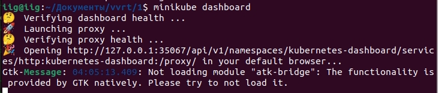
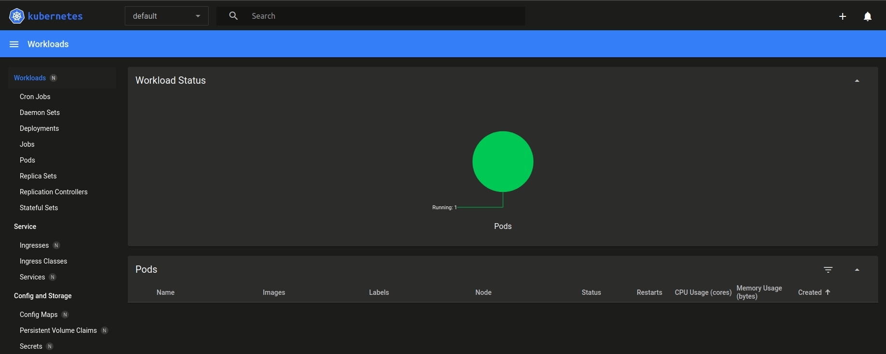
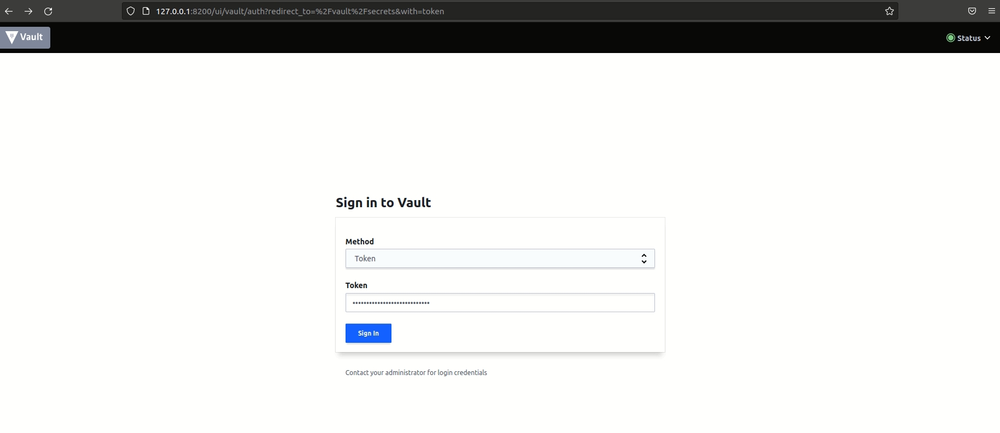
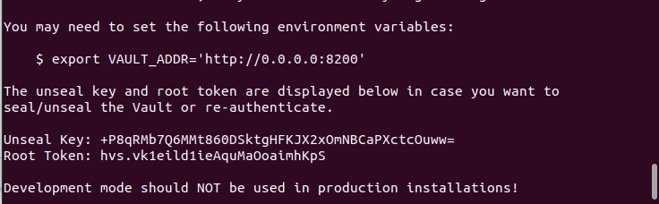
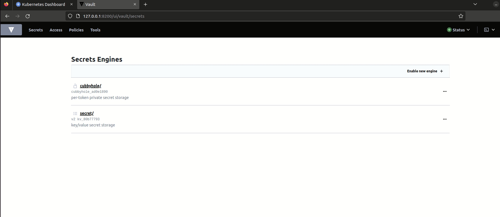

University: [ITMO University](https://itmo.ru/ru/)  
Faculty: [FICT](https://fict.itmo.ru)  
Course: [Introduction to distributed technologies](https://github.com/itmo-ict-faculty/introduction-to-distributed-technologies)  
Year: 2022/2023  
Group: K4110c  
Author: Gubenko Ivan Borisovich  
Lab: Lab1  
Date of create: 16.10.2022  
Date of finished: 17.11.2022  
---

## Лабораторная работа №1 "Установка Docker и Minikube, мой первый манифест."
### Описание
Это первая лабораторная работа в которой вы сможете протестировать Docker, установить Minikube и развернуть свой первый "под".

### Цель работы
Ознакомиться с инструментами Minikube и Docker, развернуть свой первый "под".

### Ход работы
Данную лабораторную работу рекомендуется начать с изучения [Документация по Minikube](https://minikube.sigs.k8s.io/docs/), эта статья поможет в первоначальном представлении о инструменте Minikube.

Перед выполнением лабораторной работы вам необходимо выполнить следующие задачи:

> Работу можно проводить на устройстве с архитектурой x86/arm64/ARMv7, [оригинальная инструкция](https://minikube.sigs.k8s.io/docs/start/)
- Установить Docker на рабочий компьютер

- Установить Minikube используя [оригинальную инструкцию](https://minikube.sigs.k8s.io/docs/start/)

- После установки вам необходимо развернуть minikube cluster
  
```bash
minikube start
```

- После запуска minikube cluster вы сможете взаимодействовать с k8s используя команду:
  
```bash
minikube kubectl
```

- Использование `minikube kubectl` необходимо если в вашей системе не был установлен `kubectl` (в инструкции по установке minikube это не предусмотрено), `kubectl` является инструментом по управлению обычного k8s кластера и устанавливается отдельно. Для удобства использования прописываем алиас `alias kubectl="minikube kubectl --"`. 
```bash
alias kubectl="minikube kubectl --"
```

- Запустим dashboard командой:
```bash
minikube dashboard
```
- Получаем вывод в терминал:
>

- Переходим по адресу в браузере и получаем веб-страницу с dashboard:
>

- Проверим алиас и посмотрим список запущенных подов командой:
```bash
kubectl get pod
```

- Для первого манифеста выбран образ HashiCorp Vault, более подробно можете почитать [тут](https://www.vaultproject.io). 
- Пишем манифест для развертывания "пода" HashiCorp Vault, и при этом прокидываем внутрь порт **8200**
> ВАЖНО! Вам не надо самим собирать контейнер, вы можете его взять [тут](https://hub.docker.com/_/vault/)

- Создаем файл с расширением .yaml и прописываем манифест:
```yaml
apiVersion: v1
kind: Pod
metadata:
  name: vault
  labels:
    app: vault-pod
spec:
  containers:
  - name: testname
    image: vault:latest
    ports:
    - containerPort: 8200   
```

- Подтверждаем применение манифеста командой: 
```bash
kubectl apply -f /home/user/Документы/vvrt/1/vault.yaml 
```

- Проверим список запущенных подов командой:
```bash
kubectl get pod
```
```bash
NAME    READY   STATUS    RESTARTS   AGE
vault   1/1     Running   0          28s
```

- После этого вам необходимо будет создать сервис для доступа к этому контейнеру, самый просто вариант - это выполнить команду: 
> Эта команда будет работать только если ваш "под" имеет имя `vault`:
```bash
minikube kubectl -- expose pod vault --type=NodePort --port=8200
```

- Команда выше создаст сервис, что бы попасть в контейнер пользуемся следующей командой:

```bash
minikube kubectl -- port-forward service/vault 8200:8200
```
```bash
Forwarding from 127.0.0.1:8200 -> 8200
Forwarding from [::1]:8200 -> 8200
Handling connection for 8200
Handling connection for 8200
Handling connection for 8200
```
- minikube прокинет порт вашего компьютера в контейнер и вы сможете зайти в vault по ссылке [http://localhost:8200](http://localhost:8200)

- После перехода по ссылке открывается веб-интерфейс:
>

- Далее необходимо войти в vault ипользуя токен который мы можем найти в лога командой, а не генерировать заново. 
```bash
minikube kubectl -- logs service/vault
```
>

- Введем полученый токен и авторизуемся:

>
- Для остановки minikube cluster вы можете воспользоваться командой

```bash
minikube stop
```
---
-Схема:

>
