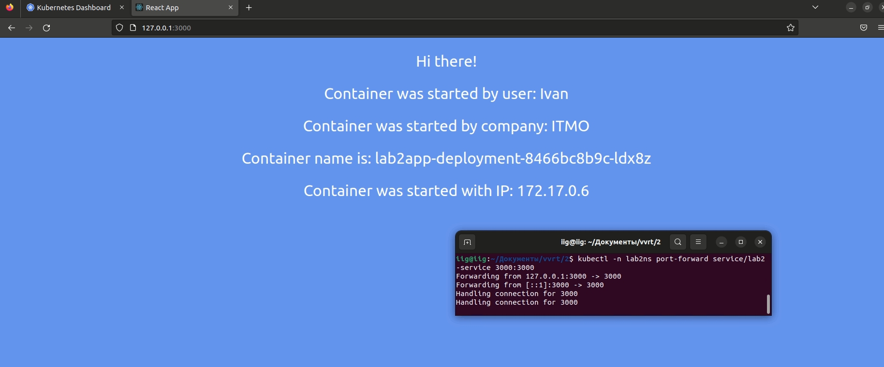
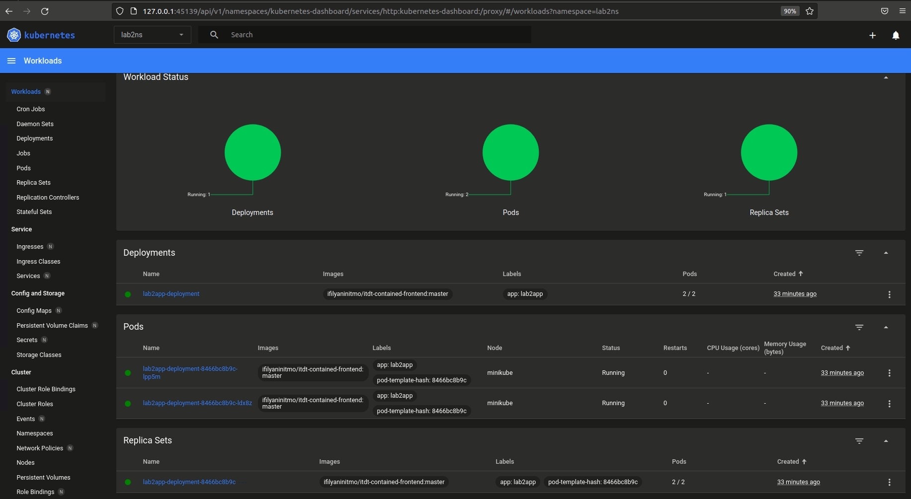
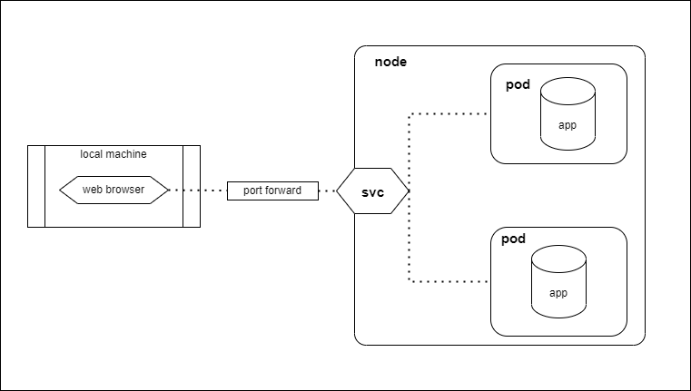

## Лабораторная работа №2 "Развертывание веб сервиса в Minikube, доступ к веб интерфейсу сервиса. Мониторинг сервиса."
### Описание

В данной лабораторной работе вы познакомитесь с развертыванием полноценного веб сервиса с несколькими репликами. 

### Цель работы

Ознакомиться с типами "контроллеров" развертывания контейнеров, ознакомится с сетевыми сервисами и развернуть свое веб приложение. 

- Вам необходимо создать `deployment` с 2 репликами контейнера [ifilyaninitmo/itdt-contained-frontend:master](https://hub.docker.com/repository/docker/ifilyaninitmo/itdt-contained-frontend) и передать переменные в эти реплики: `REACT_APP_USERNAME`, `REACT_APP_COMPANY_NAME`.

- Создать сервис через который у вас будет доступ на эти "поды". Выбор типа сервиса остается на ваше усмотрение. 

- Запустить в `minikube` режим проброса портов и подключитесь к вашим контейнерам через веб браузер.

- Проверьте на странице в веб браузере переменные `REACT_APP_USERNAME`, `REACT_APP_COMPANY_NAME` и `Container name`. Изменяются ли они? Если да то почему?

- Проверьте логи контейнеров, приложите логи в отчёт.

### Ход работы
### 0. Запуск

- Разворачиваем minikube cluster
  
```bash
minikube start
```

- Запустим dashboard командой:
```bash
minikube dashboard
```

### 1. Namespace
- Создадим namespace lab2
```yaml
apiVersion: v1
kind: Namespace
metadata:
  name: lab2ns 
```
```bash
kubectl apply -f namespace.yaml
```
```bash
namespace/lab2ns created
```
- Проверим создался ли namespace
```bash
minikube kubectl get namespace
```
```bash
NAME                   STATUS   AGE
default                Active   10d
kube-node-lease        Active   10d
kube-public            Active   10d
kube-system            Active   10d
kubernetes-dashboard   Active   6d22h
lab2ns                 Active   3m3s

```

### 2. Configmap
- Создадим Configmap env-cm

```yaml
apiVersion: v1
kind: ConfigMap
metadata:
  name: env-cm
  namespace: lab2ns
data:
    ReactAppUserName: Ivan
    ReactAppCompanyName: ITMO
```
```bash
kubectl apply -f env-configmap.yaml
```
```bash
configmap/env-cm created
```
- Проверим создался ли configmap
```bash
kubectl -n lab2ns get configmap
```
```bash
NAME               DATA   AGE
env-cm             2   
```

### 3. Deployment
- Создадим Deployment:
```yaml
apiVersion: apps/v1
kind: Deployment
metadata:
  name: lab2app-deployment
  namespace: lab2ns
  labels:
    app: lab2app
spec:
  replicas: 2
  selector:
    matchLabels:
      app: lab2app
  template:
    metadata:
      labels:
        app: lab2app
    spec:        
      containers:
      - name: lab2-container
        image: ifilyaninitmo/itdt-contained-frontend:master
        ports:
        - containerPort: 3000
        env:
        - name: REACT_APP_USERNAME
          valueFrom:
            configMapKeyRef:
              name: env-cm
              key: ReactAppUserName
        - name: REACT_APP_COMPANY_NAME
          valueFrom:
            configMapKeyRef:
              name: env-cm
              key: ReactAppCompanyName
```
```bash
kubectl apply -f lab2app-deployment.yaml
```

- Посмотрим список деплойментов:
```bash
kubectl -n lab2ns get deployment
```
```bash
NAME                 READY   UP-TO-DATE   AVAILABLE   AGE
lab2app-deployment   2/2     2            2           3m37s
```

- Посмотрим список запущенных подов командой:
```bash
kubectl -n lab2ns get pod -o wide
```
```bash
NAME                                  READY   STATUS    RESTARTS   AGE   IP           NODE       NOMINATED NODE   READINESS GATES
lab2app-deployment-8466bc8b9c-ldx8z   1/1     Running   0          20m   172.17.0.6   minikube   <none>           <none>
lab2app-deployment-8466bc8b9c-lpp5m   1/1     Running   0          20m   172.17.0.3   minikube   <none>           <none>
```

### 4. Service
- Создадим сервис:

```yaml
apiVersion: v1
kind: Service
metadata:
  namespace: lab2ns
  name: lab2-service
spec:
  selector:
    app: lab2app
  ports:
    - protocol: TCP
      port: 3000
      targetPort: 3000
```
```bash
kubectl apply -f service.yaml 
```
```bash
service/lab2-service created

```
- Посмотрим список сервисов
```bash
kubectl -n lab2ns get svc
```
```bash
NAME           TYPE        CLUSTER-IP      EXTERNAL-IP   PORT(S)    AGE
lab2-service   ClusterIP   10.96.135.245   <none>        3000/TCP   32s
```

### 5. Проброс портов
- Пробросим порты
```bash
kubectl -n lab2ns port-forward service/lab2-service 3000:3000
```
```bash
NAME           TYPE        CLUSTER-IP      EXTERNAL-IP   PORT(S)    AGE
Forwarding from 127.0.0.1:3000 -> 3000
Forwarding from [::1]:3000 -> 3000
Handling connection for 3000
Handling connection for 3000
```

### 6. Браузер
Переходим по ссылке в браузере 127.0.0.1:3000/

- Открывается страница:
>

- В дашборде:
>

### 7. Логи
- Посмотрим лог сервиса:
```bash
kubectl -n lab2ns logs service/lab2-service
```
```bash
Found 2 pods, using pod/lab2app-deployment-8466bc8b9c-ldx8z
Builing frontend
build finished
Server started on port 3000
```

- Посмотрим список подов:
```bash
kubectl -n lab2ns get pod -o wide
```
```bash
NAME                                  READY   STATUS    RESTARTS   AGE   IP           NODE       NOMINATED NODE   READINESS GATES
lab2app-deployment-8466bc8b9c-ldx8z   1/1     Running   0          20m   172.17.0.6   minikube   <none>           <none>
lab2app-deployment-8466bc8b9c-lpp5m   1/1     Running   0          20m   172.17.0.3   minikube   <none>           <none>
```

- Посмотри логи каждого пода:
```bash
kubectl -n lab2ns logs pod/lab2app-deployment-8466bc8b9c-ldx8z
```
```bash
Builing frontend
build finished
Server started on port 3000
```

```bash
kubectl -n lab2ns logs pod/lab2app-deployment-8466bc8b9c-lpp5m
```
```bash
Builing frontend
build finished
Server started on port 3000
```


### 8. Схема
>
