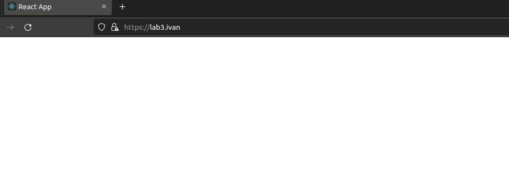
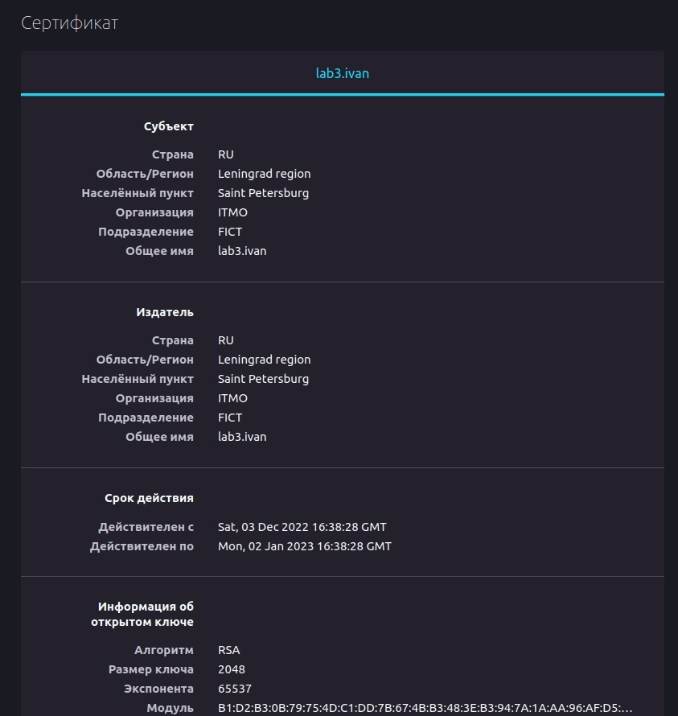
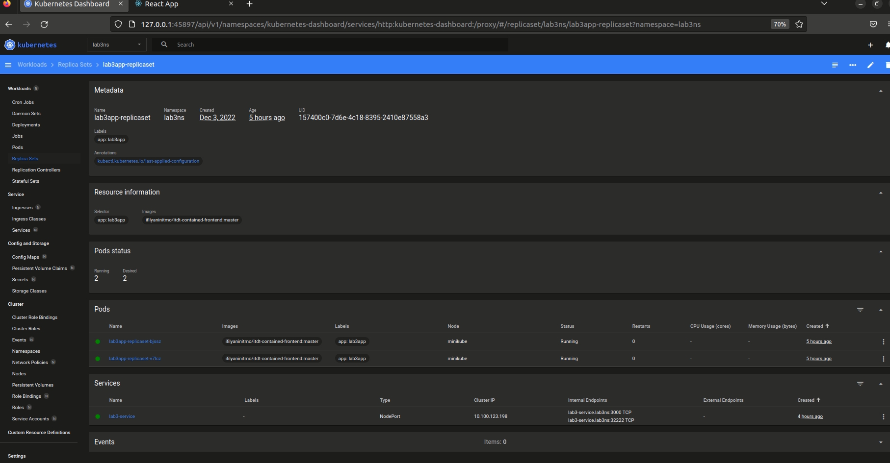
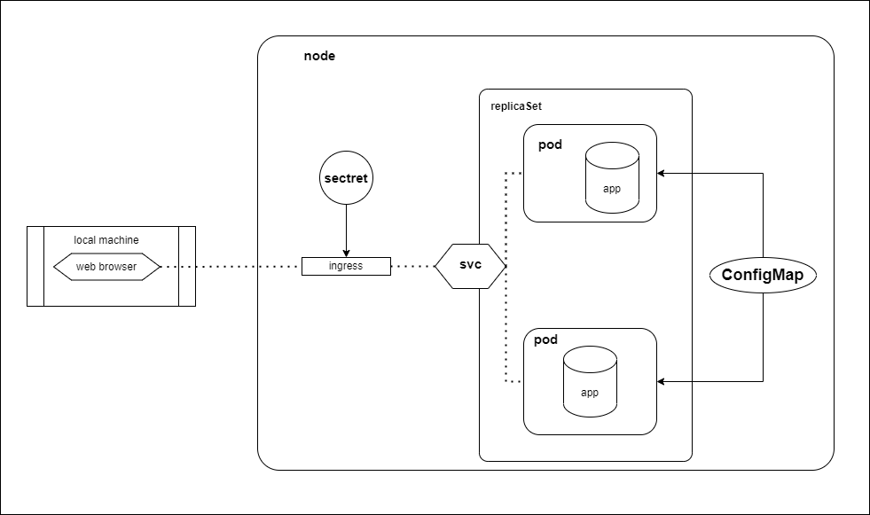

## Лабораторная работа №3 "Сертификаты и "секреты" в Minikube, безопасное хранение данных."
### Описание
В данной лабораторной работе вы познакомитесь с сертификатами и "секретами" в Minikube, правилами безопасного хранения данных в Minikube. 

### Цель работы
Познакомиться с сертификатами и "секретами" в Minikube, правилами безопасного хранения данных в Minikube. 

### Правила по оформлению

Правила по оформлению отчета по лабораторной работе вы можете изучить по [ссылке](../reportdesign.md)


### Ход работы

- Вам необходимо создать `configMap` с переменными: `REACT_APP_USERNAME`, `REACT_APP_COMPANY_NAME`.

- Вам необходимо создать `replicaSet` с 2 репликами контейнера [ifilyaninitmo/itdt-contained-frontend:master](https://hub.docker.com/repository/docker/ifilyaninitmo/itdt-contained-frontend) и используя ранее созданный `configMap` передать переменные `REACT_APP_USERNAME`, `REACT_APP_COMPANY_NAME` .

- Включить `minikube addons enable ingress` и сгенерировать TLS сертификат, импортировать сертификат в minikube. 

- Создать ingress в minikube, где указан ранее импортированный сертификат, FQDN по которому вы будете заходить и имя сервиса который вы создали ранее.

- В `hosts` пропишите FQDN и IP адрес вашего ingress и попробуйте перейти в браузере по FQDN имени. 

- Войдите в веб приложение по вашему FQDN используя HTTPS и проверьте наличие сертификата.

> Обычно в браузере это маленький замочек рядом с FQDN сайта, нажмите на него и сделайте скриншот с информацией.

______

### Ход работы
### 0. Запуск

- Разворачиваем minikube cluster

```bash
minikube start
```

- Запустим dashboard командой:
```bash
minikube dashboard
```

### 1. Namespace
- Создадим namespace `lab3ns`
```yaml
apiVersion: v1
kind: Namespace
metadata:
  name: lab3ns 
```
```bash
kubectl apply -f namespace.yaml
```
```bash
namespace/lab3ns created
```
- Проверим создался ли namespace
```bash
minikube kubectl get namespace
```
```bash
NAME                   STATUS   AGE
default                Active   23d
kube-node-lease        Active   23d
kube-public            Active   23d
kube-system            Active   23d
kubernetes-dashboard   Active   19d
lab2ns                 Active   12d
lab3ns                 Active   11s
```

### 2. Configmap
- Создадим `Configmap` env-cm

```yaml
apiVersion: v1
kind: ConfigMap
metadata:
  name: env-cm
  namespace: lab3ns
data:
    ReactAppUserName: Ivan
    ReactAppCompanyName: ITMO
```
```bash
kubectl apply -f env-configmap.yaml
```
```bash
configmap/env-cm created
```
- Проверим создался ли `configmap`
```bash
kubectl -n lab3ns get configmap
```
```bash
NAME               DATA   AGE
env-cm             2   
```

### 3. ReplicaSet
- Создадим `ReplicaSet`:
```yaml
apiVersion: apps/v1
kind: ReplicaSet
metadata:
  name: lab3app-replicaset
  namespace: lab3ns
  labels:
    app: lab3app
spec:
  replicas: 2
  selector:
    matchLabels:
      app: lab3app
  template:
    metadata:
      labels:
        app: lab3app
    spec:        
      containers:
      - name: lab3-container
        image: ifilyaninitmo/itdt-contained-frontend:master
        ports:
        - containerPort: 3000
        env:
        - name: REACT_APP_USERNAME
          valueFrom:
            configMapKeyRef:
              name: env-cm
              key: ReactAppUserName
        - name: REACT_APP_COMPANY_NAME
          valueFrom:
            configMapKeyRef:
              name: env-cm
              key: ReactAppCompanyName
```
```bash
kubectl apply -f lab3app-replicaset.yaml
```

- Посмотрим список деплойментов:
```bash
kubectl -n lab3ns get replicaset
```
```bash
NAME                 DESIRED   CURRENT   READY   AGE
lab3app-replicaset   2         2         2       29s
```

- Посмотрим список запущенных подов командой:
```bash
kubectl -n lab3ns get pod -o wide
```
```bash
NAME                       READY   STATUS    RESTARTS   AGE   IP           NODE       NOMINATED NODE   READINESS GATES
lab3app-replicaset-bjssz   1/1     Running   0          52s   172.17.0.5   minikube   <none>           <none>
lab3app-replicaset-v7lcz   1/1     Running   0          52s   172.17.0.6   minikube   <none>           <none>
```

### 4. Service
- Создадим сервис:

```yaml
apiVersion: v1
kind: Service
metadata:
  namespace: lab3ns
  name: lab3-service
spec:
  selector:
    app: lab3app
  type: NodePort
  ports:
    - protocol: TCP
      port: 3000
      targetPort: 3000
      nodePort: 32222
```
```bash
kubectl apply -f service.yaml 
```
```bash
service/lab3-service created
```
- Посмотрим список сервисов
```bash
kubectl -n lab3ns get svc
```
```bash
NAME           TYPE       CLUSTER-IP       EXTERNAL-IP   PORT(S)          AGE
lab3-service   NodePort   10.100.123.198   <none>        3000:32222/TCP   4h10m
```

### 5. TLS
- Генерируем приватный ключ
```bash
openssl genrsa -out lab3.key 2048
```
```bash
openssl req -key lab3.key -new -out lab3.csr

You are about to be asked to enter information that will be incorporated
into your certificate request.
What you are about to enter is what is called a Distinguished Name or a DN.
There are quite a few fields but you can leave some blank
For some fields there will be a default value,
If you enter '.', the field will be left blank.
-----
Country Name (2 letter code) [AU]:RU
State or Province Name (full name) [Some-State]:Leningrad region
Locality Name (eg, city) []:Saint Petersburg
Organization Name (eg, company) [Internet Widgits Pty Ltd]:ITMO
Organizational Unit Name (eg, section) []:FICT
Common Name (e.g. server FQDN or YOUR name) []:lab3.ivan
Email Address []:

Please enter the following 'extra' attributes
to be sent with your certificate request
A challenge password []:
An optional company name []:
```
- В comon name пишем доменное имя: `lab3.ivan`
```bash
openssl x509 -signkey lab3.key -in lab3.csr -req -days 30 -out lab3.crt
```
```bash
Certificate request self-signature ok
subject=C = RU, ST = Leningrad region, L = Saint Petersburg, O = ITMO, OU = FICT, CN = lab3.ivan
```
### 6. Secret
- Создади `secret` с нашим сертификатом
```bash
kubectl -n lab3ns create secret tls lab3-tls --cert=lab3.crt --key=lab3.key
```
```bash
secret/lab3-tls created
```
- Проверим добавился ли `secret`
```bash
kubectl -n lab3ns get secret
```
```bash
NAME       TYPE                DATA   AGE
lab3-tls   kubernetes.io/tls   2      3s
```
### 7. Ingress
```bash
minikube addons enable ingress
```
```bash
💡  ingress is an addon maintained by Kubernetes. For any concerns contact minikube on GitHub.
You can view the list of minikube maintainers at: https://github.com/kubernetes/minikube/blob/master/OWNERS
▪ Используется образ k8s.gcr.io/ingress-nginx/controller:v1.2.1
▪ Используется образ k8s.gcr.io/ingress-nginx/kube-webhook-certgen:v1.1.1
▪ Используется образ k8s.gcr.io/ingress-nginx/kube-webhook-certgen:v1.1.1
🔎  Verifying ingress addon...
🌟  The 'ingress' addon is enabled
```
Пропишем `Ingress` для взаимодействия с `service`

```yaml
apiVersion: networking.k8s.io/v1
kind: Ingress
metadata:
  namespace: lab3ns
  name: lab3-ingress
spec:
  tls:
  - hosts:
      - lab3.ivan
    secretName: lab3-tls
  rules:
  - host: lab3.ivan
    http:
      paths:
      - path: /
        pathType: Prefix
        backend:
          service:
            name: lab3-service
            port:
              number: 3000

```
```bash
kubectl apply -f ingress-lab3.yaml
```
```bash
ingress.networking.k8s.io/lab3-ingress created
```

- Проверим добавился ли `ingress`
```bash
kubectl -n lab3ns get ingress
```
```bash
NAME           CLASS   HOSTS           ADDRESS        PORTS     AGE
lab3-ingress   nginx   lab3.ivan   192.168.49.2   80, 443   81s
```

Пропишем адрес `192.168.49.2` в `host`

```bash
 sudo nano /etc/hosts
```
`192.168.49.2 lab3.ivan`

### 8. Результаты 
- Перейдем на страницу `https://lab3.ivan/` и посмотрим данные сертификата
> 

> 

- Отоброжение в dashboard
> 
> 
### 9. Схема




