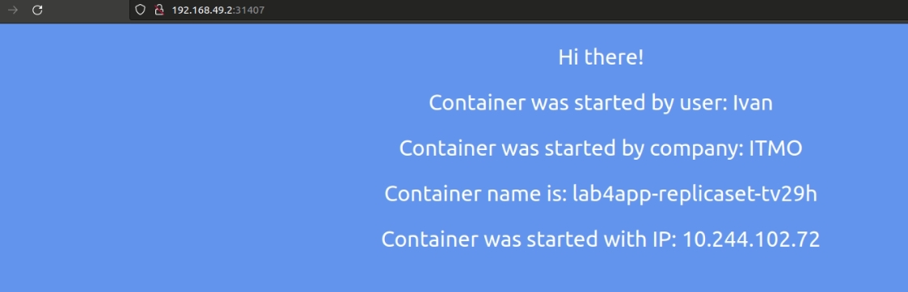
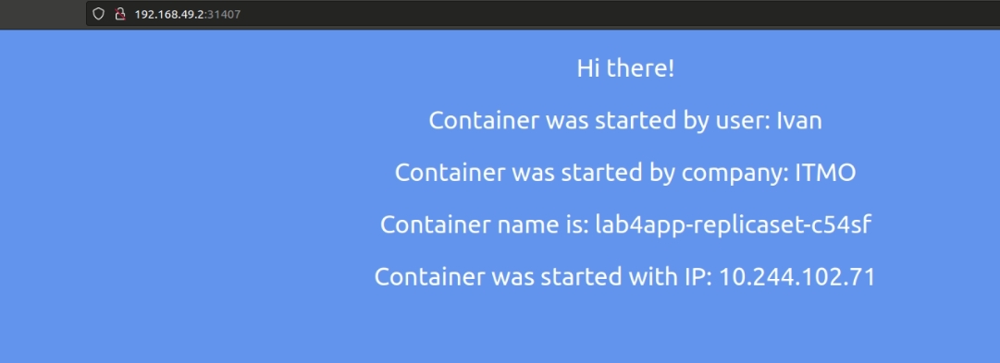
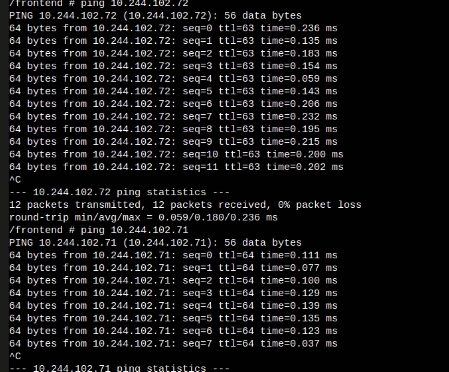
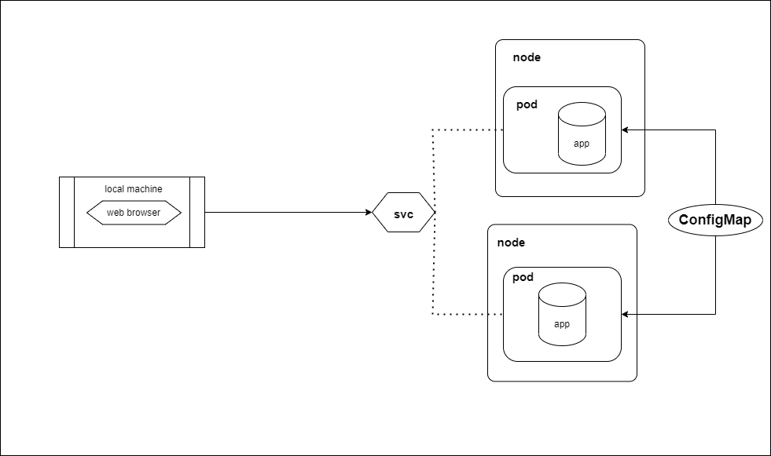

University: [ITMO University](https://itmo.ru/ru/)  
Faculty: [FICT](https://fict.itmo.ru)  
Course: [Introduction to distributed technologies](https://github.com/itmo-ict-faculty/introduction-to-distributed-technologies)  
Year: 2022/2023  
Group: K4110c  
Author: Gubenko Ivan Borisovich  
Lab: Lab3
Date of create: 03.12.2022  
Date of finished: 08.12.2022

---

## Лабораторная работа №4 "Сети связи в Minikube, CNI и CoreDNS"
### Описание

Это последняя лабораторная работа в которой вы познакомитесь с сетями связи в Minikube. Особенность Kubernetes заключается в том, что у него одновременно работают `underlay` и `overlay`  сети, а управление может быть организованно различными CNI.

### Цель работы

Познакомиться с CNI Calico и функцией `IPAM Plugin`, изучить особенности работы CNI и CoreDNS.

### Правила по оформлению

Правила по оформлению отчета по лабораторной работе вы можете изучить по [ссылке](../reportdesign.md)

### Ход работы

- При запуске minikube установите плагин `CNI=calico` и режим работы `Multi-Node Clusters` одновеременно, в рамках данной лабораторной работы вам нужно развернуть 2 ноды.

> Оригинальная инструкция для установки Calico в Minikube [ссылка](https://projectcalico.docs.tigera.io/getting-started/kubernetes/minikube)
> Оригинальная инструкция для включение 2-ух нод в Minikube [ссылка](https://minikube.sigs.k8s.io/docs/tutorials/multi_node/)
- Проверьте работу CNI плагина Calico и количество нод, результаты проверки приложите в отчет.

- Для проверки работы Calico мы попробуем одну из функций под названием `IPAM Plugin`.

- Для проверки режима `IPAM` необходимо для запущеных ранее нод указать `label` по признаку стойки или географического расположения (на ваш выбор).
  
> Оригинальная инструкция для назначения IP адресов в Calico [ссылка](https://projectcalico.docs.tigera.io/networking/assign-ip-addresses-topology)
- После этого вам необходимо разработать манифест для Calico который бы на основе ранее указанных меток назначал бы IP адреса "подам" исходя из пулов IP адресов которые вы указали в манифесте.

- Вам необходимо создать `deployment` с 2 репликами контейнера [ifilyaninitmo/itdt-contained-frontend:master](https://hub.docker.com/repository/docker/ifilyaninitmo/itdt-contained-frontend) и передать переменные в эти реплики: `REACT_APP_USERNAME`, `REACT_APP_COMPANY_NAME`.

- Создать сервис через который у вас будет доступ на эти "поды". Выбор типа сервиса остается на ваше усмотрение. 

- Запустить в `minikube` режим проброса портов и подключитесь к вашим контейнерам через веб браузер.

- Проверьте на странице в веб браузере переменные `Container name` и `Container IP`. Изменяются ли они? Если да то почему?

- Используя `kubectl exec` зайдите в любой "под" и попробуйте попинговать "поды" используя `FQDN` имя соседенего "пода", результаты пингов необходимо приложить к отчету.

### 0. Запуск 

- Разворачиваем minikube cluster

```bash
minikube start --nodes 2 --cni calico --kubernetes-version=v1.25.2
```

- Запустим dashboard командой:
```bash
minikube dashboard
```

- Проверим ноды
```bash
kubectl get nodes
NAME           STATUS   ROLES           AGE     VERSION
minikube       Ready    control-plane   8m20s   v1.25.2
minikube-m02   Ready    <none>          91s     v1.25.2
```

- Проверим поды:

```bash
  kubectl get pods -A
NAMESPACE              NAME                                        READY   STATUS              RESTARTS        AGE
kube-system            calico-kube-controllers-7df895d496-42dlq    0/1     ContainerCreating   0               8m7s
kube-system            calico-node-n9vwl                           0/1     PodInitializing     0               4m15s
kube-system            calico-node-z9x25                           0/1     Running             1               8m11s
kube-system            coredns-565d847f94-j6b9m                    0/1     ContainerCreating   0               8m7s
kube-system            etcd-minikube                               1/1     Running             1 (3m13s ago)   8m31s
kube-system            kube-apiserver-minikube                     1/1     Running             1 (3m13s ago)   8m37s
kube-system            kube-controller-manager-minikube            1/1     Running             1 (3m13s ago)   8m32s
kube-system            kube-proxy-4sqj7                            1/1     Running             2               4m15s
kube-system            kube-proxy-kr8sk                            1/1     Running             1 (3m13s ago)   8m11s
kube-system            kube-scheduler-minikube                     1/1     Running             1 (3m13s ago)   8m35s
kube-system            storage-provisioner                         1/1     Running             1 (3m37s ago)   8m18s
kubernetes-dashboard   dashboard-metrics-scraper-b74747df5-b9jwl   0/1     ContainerCreating   0               42s
kubernetes-dashboard   kubernetes-dashboard-57bbdc5f89-nrp2v       0/1     ContainerCreating   0               42s
```

### 3. Сalicoctl

-  Из документации добавим файл calicoctl.yaml
```bash
kubectl apply -f calicoctl.yaml
serviceaccount/calicoctl created
pod/calicoctl created
clusterrole.rbac.authorization.k8s.io/calicoctl created
clusterrolebinding.rbac.authorization.k8s.io/calicoctl created
```


- Посмоотрим доступные пулы ip
```bash
kubectl get ippools -o wide
NAME                  AGE
default-ipv4-ippool   4m17s
```

- Удалим дефолтный пулл 
```bash
kubectl exec -i -n kube-system calicoctl -- /calicoctl delete ippools default-ipv4-ippool
NAME                  AGE
Successfully deleted 1 'IPPool' resource(s)
```

- Добавим labelы
```bash
kubectl label nodes minikube zone=parnas
NAME                  AGE
node/minikube labeled
```

```bash
kubectl label nodes minikube-m02 zone=kupchino
NAME                  AGE
node/minikube labeled
```
- Добавим labelы свои пулы из манифеста:
```yaml
apiVersion: crd.projectcalico.org/v1
kind: IPPool
metadata:
  name: zone-parnas-ippool
spec:
  cidr: 10.244.102.1/24
  ipipMode: Always
  natOutgoing: true
  nodeSelector: zone == "parnas"

---
apiVersion: crd.projectcalico.org/v1
kind: IPPool
metadata:
  name: zone-kupchino-ippool 
spec:
  cidr: 10.244.102.2/24
  ipipMode: Always
  natOutgoing: true
  nodeSelector: zone == "kupchino"
  
```
```bash
kubectl apply -f ippool.yaml
NAME                  AGE
ippool.crd.projectcalico.org/zone-parnas-ippool unchanged
ippool.crd.projectcalico.org/zone-kupchino-ippool created
```


```bash
kubectl get ippools -o wide
NAME                   AGE
zone-kupchino-ippool   3s
zone-parnas-ippool     53s
```


### 4. ConfigMap, ReplicaSet
- Создадим configMap
```yaml
apiVersion: v1
kind: ConfigMap
metadata:
  name: env-cm
data:
    ReactAppUserName: Ivan
    ReactAppCompanyName: ITMO
```
```bash
kubectl apply -f env-configmap.yaml
configmap/env-cm created
```
- Создадим ReplicaSet

```yaml
apiVersion: apps/v1
kind: ReplicaSet
metadata:
  name: lab4app-replicaset
  labels:
    app: lab4app
spec:
  replicas: 2
  selector:
    matchLabels:
      app: lab4app
  template:
    metadata:
      labels:
        app: lab4app
    spec:        
      containers:
      - name: lab4-container
        image: ifilyaninitmo/itdt-contained-frontend:master
        ports:
        - containerPort: 3000
        env:
        - name: REACT_APP_USERNAME
          valueFrom:
            configMapKeyRef:
              name: env-cm
              key: ReactAppUserName
        - name: REACT_APP_COMPANY_NAME
          valueFrom:
            configMapKeyRef:
              name: env-cm
              key: ReactAppCompanyName
```
```bash
kubectl apply -f lab4app-ReplicaSet.yaml
replicaset.apps/lab4app-replicaset created
```


### 5. Service

```yaml
apiVersion: v1
kind: Service
metadata:
  name: lab4-service
spec:
  selector:
    app: lab4app
  type: LoadBalancer
  ports:
    - protocol: TCP
      port: 9090
      targetPort: 3000
      
```

```bash
kubectl apply -f service.yaml
service/lab4-service created
```


```bash
minikube service lab4-service
|-----------|--------------|-------------|---------------------------|
| NAMESPACE |     NAME     | TARGET PORT |            URL            |
|-----------|--------------|-------------|---------------------------|
| default   | lab4-service |        9090 | http://192.168.49.2:31407 |
|-----------|--------------|-------------|---------------------------|
```

```bash
kubectl exec -i -n kube-system calicoctl -- /calicoctl get ippool -o wide
NAME                   CIDR              NAT    IPIPMODE   VXLANMODE   DISABLED   SELECTOR             
zone-kupchino-ippool   10.244.102.2/24   true   Always     Never       false      zone == "kupchino"   
zone-parnas-ippool     10.244.102.1/24   true   Always     Never       false      zone == "parnas"   

```

### 6. Запуск

- Запустим работу сервиса 
```bash
minikube service lab4-service
```
>
>


Пропингуем командой:
```bash
kubectl exec -ti lab4app-replicaset-c54sf -- sh / lab4app # ping 10.244.102.71 -c 5
```

или в дашборде:
```bash
 ping 10.244.102.71 
```
>
### Диаграмма
>